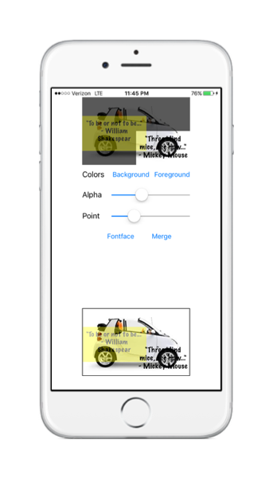

# MMSLayeredView
[](https://travis-ci.org/miller-ms/MMSLayeredView)
[](http://cocoapods.org/pods/MMSLayeredView)
[](http://cocoapods.org/pods/MMSLayeredView)
[](http://cocoapods.org/pods/MMSLayeredView)
[](http://clayallsopp.github.io/readme-score?url=miller-ms/mmslayeredview)

This **MMSLayeredView** class provides the features for layering **UIViews** on a background view and saving the composite image to a png file.  The layered views can be moved, resized, and scaled within the confines of the view's frame.

<p align="center">

</p>

## Basic Usage
To run the example project, clone the repo, and run `pod install` from the Example directory first.

Create a MMSLayeredView object.  Add it to a subview of one of the application's UIViewController subclasses. Or in Interface Builder add a UIView to a subview of one of the UIViewControllers.   In the Identity Inspector, select the class _MMSLayeredView_.  Size it as you see fit for your application's needs.

Add a background view to the object.  The background view can be a UIView or any subclass of _UIView_.  Typically, you would add a _UIImageView_ as the background view.  Call the method __addBackgroundView__ to set the background view.

```swift
override func viewDidLoad() {
    super.viewDidLoad()

    let exampleLayeredView = MMSLayeredView.init(frame: CGRectMake(20.0, 20.0, 100.0, 100.0))

    view.addSubview(exampleLayeredView)

    let backgroundImage = UIImage.init(named: "example.jpg")

    let backgroundView = UIImageView(image: backgroundImage)

    backgroundView.contentMode = .ScaleToFill

    sourceView.addBackgroundView(backgroundView)

}
```
__addBackgroundImage__ adds the view to the subview, resizes the height and width to match the dimensions of __exampleLayeredView__ and sets the frame's origin to (0,0). 

Once the background view is set, all subviews added will display above the background view in the z-order. The background view can be set in a sequence with respect to adding subviews; it will always display behind all the subviews in the z-order.

Set a unique tag for the view to access any one of the subviews with the method:

```swift
    viewWithTag(tag:Int)
```
Add, remove, and reorder subviews to the layered view with UIView view hiearchy methods: 
```swift

    addSubview(view:UIView)

    removeFromSuperview()

    insertSubview(view:UIView, atIndex: Int)

    insertSubview(view: UIView, aboveSubview: UIView)

    insertSubview(view: UIView, belowSubview: UIView)

    exchangeSubviewAtIndex(index1: Int, withSubviewAtIndex: Int)

    sendSubviewToBack(view: UIView)

    bringSubviewToFront(view: UIView)

```
The user selects one of the subviews for the focus of application operations by tapping the view.  When tapped the view shows it has focus by filling the area outside it's perimeter with a translucent black.  To get the UIView with focus access the property:

```swift
public var viewWithFocus: UIView?
```
Finally, this class supports the capability for merging the background view and subviews into image.  With this feature, you can use the class to build applications providing the feature to layer text over images, decorate images with stickers, or both. This is the public method supporting export to image:

```swift
public func mergeTextAndImage() -> UIImage?

```
## User Interaction
This class gives the application user the following operations:
* __Scale Subview__: Pinch gesture.
* __Move Subview__: Double tap to give move focus to the view then drag it.
* __Size Subview__: One finger drag gesture to size dimensions independently.
* __Give Subview Focus__: One finger tap gesture gives focus to a subview and removes it when it already has focus. Tap the background view to give it focus.
## Requirements
MMSLayeredView requires iOS 8.0 or later.
## Installation
MMSLayeredView is available through [CocoaPods](http://cocoapods.org). To install
it, simply add the following line to your Podfile:

```ruby
pod "MMSLayeredView"
```
## Author
William Miller, support@millermobilesoft.com
## License
This project is is available under the MIT license. See the LICENSE file for more info. Add attibution by linking to the [project page](https://github.com/miller-ms/MMSLayeredView) is appreciated.
